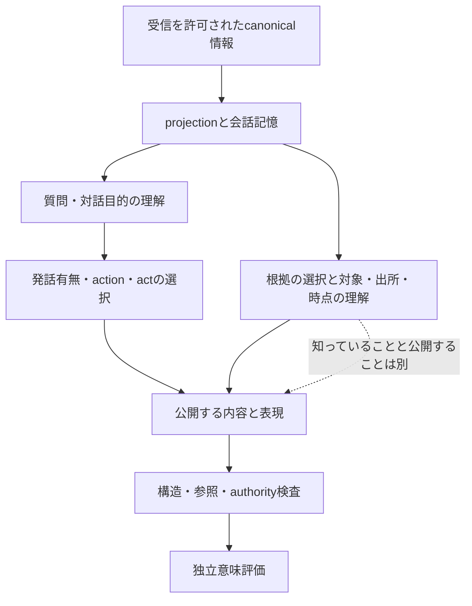

# Phase 6 会話品質：仮説一覧（T489）

## 位置づけ

作業開始2026-09-22 20:20 JST。最新指示は23:00 JSTまで仮説整理、以降はテストケースと
ワンコマンド入口の作成、翌00:30 JST完成目安。テスト実行はしない。
これは**仮説形成資料**であり、原因確定・設計承認・候補採用ではない。
23時前はコード変更なし。provider、候補実測、旧出力再採点は行わない。
関連sourceの限定読込みは、既に存在する契約と仮説の区別のために行う。
公開済み集計と公開sourceだけを使用し、private本文の新表示は行わない。

## 既知の制約と測定

- T478確定判定：GB1不採用。HARD fail14→12、SEMANTIC pass7→12、STYLE pass15→24、act/text不一致23→3。
- 秘密開示5→6、固定18質問回答9→5、合法NONE0/2、peer長文copy3/31で個別gate不合格。
- 捏造0、状態矛盾1、能力矛盾0、UNKNOWN0。主原因分類A choice不適切14、basis支持不整合10。
- GB1の出力kindはCLAIM23/QUESTION9（T480既存測定）。非NONE増加と回答率改善は同じではない。
- 5モデルの旧160生成ではNONE固定。本文回答能力は異なる。C1/C2/K1/I1/S1/P2/IC2/GC2/SC2/GB1は再生成・再採点しない。
- context超過、token proxy、モデル大型化だけの説明は今回の主因仮説へ戻さない。
- schema存在検査、動的参照検査、authority/visibility、copy等の検査は既存。自由文の全意味を保証しているとは限らない。
- 指標改善は候補の因果効果の証明ではない。GB1はchoiceとuser catalogが同時に変わる。

根拠：`Docs/ai/handoffs/tasks/T478_GROUNDING_BASIS_QUALITY.md`、`Docs/ai/handoffs/tasks/T480_GROUNDING_BASIS_MEASUREMENT.md`、`Docs/ai/decisions/D077_SYNTHETIC_QUALITY_GATE.md`。
比較基準の再採点はしない。以下の「予測」「反証案」はまだ実行していない。

## 仮説の採録基準

別の因果機構か、既存仮説と異なる観測を予測するときだけ別IDにする。
同じ原因の言い換え、oneOf順・注意書き・罰則の総当たりは数えない。
各仮説の最小確認は将来の候補であり、その実行権限・設計承認を付与しない。
「反証」は対象の限定した説明を弱める意味で、モデル全般の能力を否定・立証する意味ではない。

## 第1巡：因果機構の発散

### A. 発話目的と行動選択

| ID | 仮説・機構 | 支持する既知事実／反対材料 | 識別予測・最小反証案・交絡 |
|---|---|---|---|
| H01 | 発話の対話目的より先にact名を選ぶため、「質問に応答する」目的を決めないままCLAIM等へ固定される | choice不適切14、回答5/18。反対：元入力に質問自体は存在する | 同じ質問に対する目的理解とact分類を別々に問う公開syntheticで、目的は正しく分類だけ誤るなら本仮説を弱める。語彙難度との交絡を分離 |
| H02 | choiceがreply sourceを選ばず、二段目で「何への応答か」を後から再構築するため対話対象を失う | GB1 choiceはkind＋fact IDsだけ。反対：全inputは二段目にもある | 質問の内容を同じにし、無関係なpeer発言を増やすと応答先誤りだけが増える予測。新しい公開対照でsource選択と本文回答を別判定 |
| H03 | 「発話するか」と「発話した場合のact」が別変数として計画されず、kind選択が発話を既定にする | 合法NONE0/2。反対：decision noneは既に合法 | 発話不要場面でdecision noneの表現可能性と、NONEの意味理解を分離する。待機文のactと無発話を同一採点にしない |
| H04 | ability/action/COの判断より先にactを固定すると、後のactionとの整合が取れない | G15-1でnone/DECLARE構造競合。反対：既知CO helperはoffline承認済み | CO helperで閉じる構造問題と、発話目的の意味問題を別分母にする。CO修正だけで秘密/回答が改善するとは予測しない。既存CO検証を繰り返さない |
| H05 | 一つの発話に回答＋反論等が含まれるため、単一kindという観測が本文を十分表現できない | 単一kind契約。反対：単純質問でも失敗しているので全体説明にはならない | 単一行為と複合行為を分けた公開対照で、後者だけ分類不一致が増えるか。複数kindを製品に追加する判断は含めない |
| H06 | topic/stance等の既存分類が自然な回答内容と噛み合わず、答えやすいCLAIMへ逃げる | ANSWERにもtopic/stanceが必要。反対：既存合法ANSWERがある | 理由説明・未知の表明・手続き回答を同じ分類で損失なく表せるかを先に検討。単に合法JSONを作れるだけでは意味対応の反証にならない |
| H07 | 同じcallでstate updatesまで要求することで、不要な新主張を作る方向へ目的が変わる | optional updatesを含むfull output、copy/主張の支持不足が残る。反対：空updateは合法 | 応答だけで完結する場面と更新が必要な場面を分離。全update削除やP2再実行を解決策としない。情報量差を交絡に残さない |

### B. 根拠の形と意味上の支持

| ID | 仮説・機構 | 支持する既知事実／反対材料 | 識別予測・最小反証案・交絡 |
|---|---|---|---|
| H08 | atomic leafを選ぶ方式では、主体・述語・値の結び付きを選べず、正しいIDから誤った命題を作る | catalogはaliveやresult_id等のleaf、basis支持不整合10。反対：pointer先の親recordはinputに残る | 同じ値を持つ複数対象を含む公開対照で取り違えが増える予測。ID存在と命題支持を別検査。複合fact化は未承認設計 |
| H09 | 根拠が真であることと、現在の質問に関係することを混同する | 捏造0でも回答不足・支持不整合。反対：関連factを選んでいる可能性は集計だけでは不明 | 真だが無関係なfactと、質問に直接関係するfactを両方置く対照。選択の関連性と本文の真偽を別判定 |
| H10 | basis catalogが世界状態・能力中心で、質問理由に必要な公開会話の論拠を選ぶ経路を持たない | catalog allowlistに会話本文・自己claimはない。反対：memoryは消えていない | 状態質問と会話理由質問で差が出る予測。会話用の根拠選択を製品authority factへ混入させず、発言という事実と発言内容の真偽を分ける |
| H11 | factを先に選ばせること自体が「そのfactを公表する」課題へ見えるため、回答より事実紹介を生成する | CLAIM23、秘密6、回答5。反対：fact選択とchoice変更の効果が交絡 | 私的判断にだけ役立つfactと公開回答に必要なfactを分ける公開synthetic。選択したことと開示を独立に扱えるなら弱まる。注意書き追加を即提案しない |
| H12 | opaque ID→pointer→親recordという多段参照が正確な対象解決を妨げる | 値を複製せずIDとpointerだけ。反対：構造bindingは全件一致し、能力矛盾0 | 模型の自己完結した参照課題で、ID存在・pointer解決・対象/値対応を分ける。server側resolverの正しさはモデル理解の証拠ではない |
| H13 | 日付・時点が選択leafから離れており、現在状態と過去観測の意味を混同する | currentとability recordの時点が別field。反対：今回は状態矛盾1のみ、主因とは断定不可 | 同一対象の複数時点・古い公開claimを含む対照。時点を変えない対照も必要。実測未読rawで事例を捏造しない |
| H14 | 肯定/否定や種族判定と陣営判定を同じ命題として扱う | not_wolfと陣営は別契約。反対：GB1能力矛盾0 | not_wolf、wolf、未知、公開claimを区別する公開対照。ラベル変更・役職rule変更をしない。GB1の既知失敗原因と断定しない |
| H15 | 有効EvidenceRefを付けられたことで、根拠が主張を含意するという誤った確信が生じる | 捏造0と支持不整合10は両立。反対：生成過程の確信は未観測 | 実在するが反対内容の発言を参照するケースで、存在チェックはPASSでも支持はFAILになる予測。validatorを緩めず、実在/出所/支持を分ける |
| H16 | basis最大2leafでは一つの能力命題のtarget/result/event等を一緒に選べず、必要根拠が分断される | 最大2はchoice32tokens由来。反対：input全体は参照可能で、全fieldを選ぶ契約ではない | 単一命題に必要な意味要素数と、選択leaf数を混同しない。選択basisを「十分な証明」と読む場合にのみ予測が立つ。token拡大で回避しない |

### C. 視点・秘密・会話記憶

| ID | 仮説・機構 | 支持する既知事実／反対材料 | 識別予測・最小反証案・交絡 |
|---|---|---|---|
| H17 | private knowledgeを持つこと、公開してよいこと、公開すると得になることを区別できていない | 秘密開示6、構造private境界は維持。反対：合法的な戦略開示は存在 | 非公開知識/既に公開されたclaim/正当なCOを分け、過剰拒否も見る。secret regexや全role非開示を解決策にしない |
| H18 | actor/subject/addresseeと一人称の対応付けが崩れ、他者の発言を自分の立場として再使用する | peer copy3、self copy2。反対：長文copyと主体誤認は同義ではない | player IDの全体的な一対一置換で意味不変の対照を作る案。単なる名前順変更や過去32caseのrerunとは分離 |
| H19 | 最新発言への応答ではなく、入力会話を要約・継続補完する課題として理解している | 全文copyが残り、質問に新情報を返せない。反対：明示systemは会話継続を要求 | 同じ意味を持つが表現を共有しない複数話者を置き、引用/賛同/自分の回答を分ける。copy抑制だけで対話理解改善としない |
| H20 | 自己roleや能力属性の説明が目立ち、今回の対話目的より自己説明へ注意が向く | role由来秘密と紹介傾向の既知観測。反対：systemに紹介回避は既にある | 個人知識に無関係な質問と、能力説明が必要な質問を対照にする。role隠蔽や既知のfield順総当たりはしない |
| H21 | memory中の過去claim・belief・実状態の証拠水準を同一視する | self_co/state/memory/currentが併存。反対：systemはauthoritative優先を明示 | 同じ内容を噂・自分の過去発言・能力結果として与えた新公開対照で区別できるか。別の真実sourceを作らない |
| H22 | syntheticのstate.strategy等が空のため、自己claimを継続する動機を推測できず毎回新しい自己像を作る | fixtureは大半を新captureから構築。反対：既存self_coは一部caseにある | 完全な過去stateと、公開claimだけ存在する状態を分ける。新strategyをhostが書き込む案ではない。実gameへ外挿しない |
| H23 | memoryの選択順位が会話上の因果連鎖より重要度/時系列を優先し、返答に必要な前提が離れる | bounded projectionには選択順位がある。反対：小さな固定caseでは全前提が残っている可能性が高い | 内容欠落と位置の遠さを区別。新しい長い公開対照だけで将来検討。既存context不足説を復活させない |

### D. 課題指示・decode・表現負荷

| ID | 仮説・機構 | 支持する既知事実／反対材料 | 識別予測・最小反証案・交絡 |
|---|---|---|---|
| H24 | user payload全体をuntrustedと呼ぶため、質問を「応答対象」として扱うことまで抑制する | systemはデータをinstruction扱いしないと規定。反対：本文では回答できる例もある | 悪意ある指示には従わず質問には答える二つの能力を分ける公開対照。データをsystemへ昇格させない |
| H25 | 多数の異種制約が一つのsystemにあり、局所的な合法JSON生成が対話目的より優先される | full output契約、NONEからCLAIM等への失敗形変化。反対：単なるinstruction不足とは言えない | 構造合法性を固定した新しい最小対話課題で意味だけを確認する候補。警告追加/既却下I1/S1/P2再実行はしない |
| H26 | schemaがdecode制約には使われても意味説明として十分に読まれず、kind語の一般的意味だけで選ぶ | enumの役割理解とJSON合法性は別。反対：既存systemにkind説明がある | 新公開語彙理解課題でinstructionのみ/契約説明の理解を区別する案。runtime schema適用不備を証拠なしで主因にしない |
| H27 | 32token choiceで形式は足りても、kind・basisを同時に判断する過程が限定される | 最大choiceは27tokens以内という既存計数のみ。反対：length超過の証拠なし | 語数上限の不足と、複合判断の困難さを分ける。予算拡大・thinking mode/model変更は今回しない。単純能力が保持されるかを先に考える |
| H28 | 200文字内に回答・根拠・態度を詰めることで、説明を諦め一般論やcopyへ寄る | 短文制約がある。反対：最大output余裕/length0という旧測定と両立し、token枯渇説ではない | 一文で十分な質問と複数前提を要する質問を分ける。文字上限を上げず、自然文意味上の必要量を識別 |
| H29 | 固定decode条件の一つの高確率モードに入るため、kind分布が極端になる | 旧全NONE、GB1は2kindのみ。反対：5モデル共通はdecodeだけでなく共通契約も示唆 | 新しい語義対照を先に置き、単一seed32件から一般分布を推定しない。seed/temperature総当たりや同条件retryはしない |

### E. 評価・実験の識別限界

| ID | 仮説・機構 | 支持する既知事実／反対材料 | 識別予測・最小反証案・交絡 |
|---|---|---|---|
| H30 | 固定18回答指標は安全な非開示・戦略的保留も非回答にし、能力低下と方針差を混ぜる可能性がある | secrecy/ability caseでは開示optional。反対：既存採否gateは明示済みで変更しない | 将来の新対照で質問に応じた安全な拒否/未知の回答/無関係発話を分ける。旧annotationを変更・再採点しない |
| H31 | 合法NONEのcontrolは「NONEも合法」と「NONEだけが正解」を混同する余地がある | fixtureはwaiting/neutral may use NONE、expected_actsはNONE。反対：過去gateはNONE維持を要求 | 新しい診断で合法集合の包含と生成選好を別評価。GB1不採用を撤回せず、HARD秘密等の独立FAILも残す |
| H32 | 同一状況の2表現variantを独立32状況と見なすと効果の頑健性を過大評価する | 16group×2構成。反対：既存32分母は受入契約であり維持 | 新結果を得るならgroup単位とcase単位を分離記録。旧集計再計算や恣意的な分母変更はしない |
| H33 | GB1の改善はbasis選択効果だけでなく、choice分布・catalog追加・source差の複合効果である | 承認設計自身が交絡を明記。反対：binding/source差は保存済み | 一変数を切り分けた新仮説が必要。既存SC2/GB1を再生成して因果同定したことにしない |
| H34 | mismatch減少は適切な対話ではなく、誤ったchoiceに本文を合わせたことで起きている | mismatch3でも回答5、秘密6 | 同じkindでも質問へ答えているかを独立に見る。既存指標改善だけを成功としない。H01とは結果解釈の反対仮説 |
| H35 | 単発fixtureでは、次turnでの訂正・claim継続・他者反応への適応能力を識別できない | 現測定は32独立decision、実game禁止。反対：単発のHARD違反を免責しない | 将来の短い合成会話だけで更新前後を分離する案。通常gameを診断に使わず、既存32の役割は維持 |
| H36 | 小標本と1回生成では、観測した±1の秘密差の再現性はまだ分からない | 5→6。反対：今回の必須非回帰条件は既にFAIL | 不確実性を記載してgateは維持する。統計的有意性がないことを非回帰の証明としない。再試行して良い結果を選ばない |

## まだ結論にしないこと

- H01/H08等の説明力は、対応する既存観測と矛盾しないという意味に留まる。
- choice不適切14件とbasis支持不整合10件から、特定のprompt句やmodel内部機構を断定できない。
- sourceの構造的事実だけでは、LLMがそれをどう解釈したかは観測できない。
- 「基盤は正しいからmodelが弱い」「modelは答えられるからschemaだけが原因」の二択にはしない。
- 未知のruntime不具合は論理的には可能だが、既存wire/hash/cleanupの強い照合証拠に逆らって上位原因へ置かない。

## 第2巡：反対仮説と説明範囲

### 新しい識別軸

| ID | 仮説・機構 | 既知との関係／反対材料 | 識別予測・最小反証案・交絡 |
|---|---|---|---|
| H37 | 空basisが「根拠不要の問い/保留」と「根拠を見つけられない断定」を同じ形で表す | 全kindで空合法。反対：本文/stanceで区別可能かもしれない | 空を禁止せず、根拠不要・不足・不使用を分けた公開対照で違いを観察する候補。H16の容量不足とは異なる |
| H38 | basisの用途が「発話内容の証拠」か「その行動を選ぶ私的理由」か曖昧で、評価側との意味契約がずれる | selected basisという文面、支持linkなし。反対：個別明確なHARD違反を免責しない | 同じ私的知識から秘密を述べず質問を選ぶ反例を置き、basisと本文が直接含意しなくても合法かを区別。H11の開示誘導とは逆方向 |
| H39 | 不適切planへの忠実な追従と、適切planの無視をまとめると誤った次介入を選ぶ | choice不適切14/追従不良copy4/支持不整合10。反対：既存評価自体は個別に判定している | 将来の新syntheticでplan適合・plan追従・主張強度を独立記録。旧caseへの新分類付け直しはしない |
| H40 | 勝利条件を知っていても、今回の会話での利害へ接続せず、通常の自己説明/事実提示を選ぶ | contextにwin_conditionsはあるが、存在は理解の証明でない。反対：局所的な回答失敗は勝利推論なしでも説明できる | ゲーム利害と無関係な質問理解が正常で、公開/秘匿の利害がある課題だけ崩れる予測。勝利ruleやモデルを変更せず、新しく戦略の正解を固定しない |
| H41 | 意図的な虚偽と誤った信念を、最終本文だけでは区別できず、品質原因が同定できない | 騙りは合法、能力/状態の誤認は抑制対象。反対：非戦略的な秘密自白や既知構造違反は独立に判定可能 | 模型の公開命題と私的な根拠理解を別観測する評価案が必要。自己申告の「意図した嘘」だけでHARDを免責しない。評価境界を勝手に変更しない |

### 対立予測表

| 比較 | 両者で一致する観測 | 違いが出るべき観測 | 今回の集計だけで決められるか |
|---|---|---|---|
| H01目的選択不足 vs 本文生成能力の不足 | 質問未回答 | 自然文で目的を述べる課題は正しいが内容生成だけ失敗するか | いいえ |
| H08/H12参照結合の困難 vs H09関連性選択の困難 | 正しいIDでも不適切本文 | 無関係なfactを正確に復元するか、関連factを選ぶが誤って復元するか | いいえ |
| H11選択factの公表誘導 vs H17公開判断の弱さ | 秘密開示 | basisを使わない公開判断課題でも秘密開示するか | いいえ。baseline秘密5は後者とも整合 |
| H03発話有無の混同 vs H31controlの評価契約 | NONE不使用 | 生成が本当に不適切か、合法な別行動なのか | いいえ。既存採否は変更しない |
| H05複合act vs H06taxonomyの表現範囲 | ラベルと本文の不一致 | 単一行為の内容でも表現先がないか | いいえ |
| H24データ不信の過適用 vs H19会話補完の解釈 | 質問未回答 | 悪意のない質問を無視するのか、直前発話を復唱するのか | いいえ |
| H27同時判断の負荷 vs H29decodeモード | kindが偏る | 他の意味選択が同じ難度でも正確か、語彙だけを変えると傾向が消えるか | いいえ |
| H38basis用途の曖昧性 vs H15支持関係の誤認 | basisと本文に直接含意がない | 私的理由としては妥当な行動か、どの用途でも無関係か | いいえ |

### 見かけ上の「原因」を除外する

1. **低いact/text不一致だけでは十分でない。** 誤ったchoiceに忠実ならH34を満たす。
2. **大きい表現能力だけでは十分でない。** 合法な応答がschema内に存在しても、それを選ぶ確率や目的理解は別。
3. **small contextだからattention問題なしとは言えない。** ただし物理的なcontext不足を原因には戻さない。
4. **捏造0はすべての発言が真である意味ではない。** 存在・支持・確実性・戦略的虚偽を分ける。
5. **5モデル共通だからruntime bugとは言えない。** 共通input/契約/fixtureも共通原因候補。wireの既存証拠を無視しない。
6. **一つのschema gapを閉じても品質回復とは言えない。** CO helperは構造違反の限定修正で、会話品質は未測定。
7. **snapshotに明示情報があるからモデルがそれを使ったとは言えない。** 未読rawの推測でcase原因を決めない。

## 次の検証を選ぶ前に必要な区別

最小単位は「入力を理解する」「適切な目的を選ぶ」「根拠を選ぶ」「その根拠で述べられる内容を選ぶ」
「公開するかを決める」「短い表現とmetadataを一致させる」のどこか一つ。
これらを一回でまとめて改善する候補は、現在の41仮説を識別しない。
評価を細分化する案にも、正当な保留・騙り・非開示を固定正解で潰さない制約がある。

## 第3巡：層をまたぐ抜けの点検

| ID | 仮説・機構 | 他IDとの差 | 識別予測と限界 |
|---|---|---|---|
| H42 | triggerが指すイベントは保持されても、応答に必要な本文の意味部分がexcerpt外、またはイベント型に適切に投影されない | H02は到達するsourceの選択、こちらは到達する内容そのもの | 末尾の質問節が保持範囲外ならtopicだけ残り、短い対照より応答不良。既存32で起きたとは未確認。context不足ではなく個別fieldのexcerpt境界 |
| H43 | basis IDとEvidenceRefが異なるnamespace・参照範囲・目的を持ち、片方に正しく従っても他方へ接続できない | H08はrecord内binding、こちらは二種類の参照表現間の対応 | current factに対応イベントrefがない等の正当ケースと、対応できるのに誤対応するケースを分離。根拠0の合法発言を一律拒否しない |
| H44 | joint choiceで先に生成された選択が後続選択を条件付け、望む判断順と異なる方向の依存が起きる | H27は負荷、こちらは自己回帰の条件付き依存方向 | kind→basis、basis→kindのどちらかは実生成順を見ずに決めない。kindとbasisの周辺分布が良くても組合せが不適切になる予測。順の再総当たりはしない |
| H45 | opaque IDの意味より位置や語彙としての出やすさに選択が引かれる | H29はrun全体のモード、こちらは同じkind内のfact選択 | 意味同型の新対照でID名/位置に追従するなら支持。tokenizationとgrammarも変わる交絡がある。旧caseのID順交換rerunはしない |
| H46 | QUESTION等の非断定形にも未確認の前提が埋め込まれ、act整合が高くても誤情報が残る | H05複合actやH15証拠参照の問題がなくても起きる | 「本当に起きたか」と「起きたことを前提に理由を聞く」を新公開対照で分ける。疑問符やQUESTIONだけを安全判定にしない |
| H47 | 数値confidence、stance、本文の断定強度が別々に生成され、弱いbeliefから強い断定が出る | H14は命題の論理的含意、こちらは同じ命題への確信の表現対応 | 同じ命題で不確実stateと確定結果を区別できるか。モデルの数値が校正された確率だとは仮定しない。confidence閾値で戦略をhost決定しない |
| H48 | 引用・仮定・否定のscopeを平坦化して、他者の主張や仮定を自己の断定へ変える | H21は情報源の信用、こちらは同じ情報源・同じ真偽でも文中scopeが違う | 「Pと言った」「もしPなら」「Pではない」を同一Pと混同するか。単語一致で秘密/捏造を判定しない |

### Architectからの統合

詳細機構は `Docs/ai/handoffs/tasks/T488_HYPOTHESIS_NOTES.md` にある。以下は数を増やすために重複採録しない。

| T488 ID | T489対応 | 扱い |
|---|---|---|
| H1/H2/H3/H4 | H08/H14/H21/H15 | 同一または包含 |
| H5/H6/H7/H8/H9 | H37/H17/H10/H01/H03 | 統合 |
| H10/H11/H12/H13/H14 | H27/H16/H12/H39/H38 | 統合 |
| H15/H16/H17/H18 | H02/H19/H25/H45 | 下位機構を説明へ反映 |
| H19/H20/H21/H22 | H42/H43/H13・H21/H44 | 新3件＋既存時点仮説へ統合 |

### 経路ごとの反対確認

この図は**診断上分ける概念**であり、実装のcall数・実行順を変更する設計ではない。
各矢印について、上流の正しさから下流を推定していないかを点検した。

- canonical情報が正しくても、参照先を理解したとは限らない（H12/H18/H21）。
- 質問を理解しても、秘密保護等の理由で応答方針が異なる場合がある（H17/H30/H40）。
- 方針が妥当でも、kindへの写像や本文の実現で失敗し得る（H05/H06/H39）。
- 正しい根拠を使っても、強すぎる断定や前提の混入が起き得る（H14/H46/H47）。
- 構造検査を通っても、質問への回答や自由文の支持は別である（H15/H34/H43）。
- 評価結果が正しくても、単発・固定caseから未知の会話への一般化は別である（H32/H35/H36）。

### 弱い版と強すぎる版を分ける

| 強すぎる主張（現時点で採らない） | 残せる限定仮説 |
|---|---|
| atomic ID化で親recordの情報が完全に失われた | full inputに親recordは残るが、モデルが正しくjoinしない可能性 |
| basis最大2だから必要な事実を全く読めない | 全inputを読めるが、選択を十分な証拠と誤解する可能性 |
| 質問を全てmandatory ANSWERにすれば解決 | 正当な保留/非開示を残して対話目的を理解する必要 |
| 私的情報は公開できないという権限制約を追加すべき | 受信権限と戦略的公開判断は別。正当COや騙りを残す |
| 秘密開示6件はモデル能力不足の証明 | 入力・方針選択・表現・評価の別説明が未分離 |
| fabricated evidence 0はbaselineより改善 | baselineも0。GB1の支持不整合10とは別指標 |
| 48件の仮説があるので48実験が必要 | 同じ識別対照で複数候補を除外できる。仮説数は実行数ではない |

H44の前提には特に注意する。helperのPython literalはkindを先に書くが、
`scripts/phase6_context_probe.py::wire_bytes` は`sort_keys=True`で、shared runtimeがそのwireを使う。
wire上のpropertiesは`authoritative_fact_ids`が先になる。source記述順、送信schema順、native converter順、
実出力key順を同じと仮定しない。今回はprivate rawを再表示して実順を確認していない。
これは旧kind-first/field順変更probeの再開理由にしない。

## 第4巡：入力・schemaが正しい場合の対立説明

T490の別視点から、既存と異なる予測を持つ以下を統合する。詳細と反証条件は
`Docs/ai/handoffs/tasks/T490_HYPOTHESIS_COUNTEREXPLANATIONS.md`。全て未検証。

| ID | T490 | 機構・既存との差 | 予測と交絡 |
|---|---|---|---|
| H49 | C01 | 単独では容易な条件でも、全条件を一つの出力で満たす合成信頼性が低い。注意希釈H25と違い独立な小条件でも起こる | 条件の単独成功と結合成功を分ける。一般には条件付き確率の積で、周辺成功率の積には独立性が必要。条件追加で生成分布も変わるので単調性を法則としない |
| H50 | C02 | 同じく真で関連性もある候補の中で、確認に必要なjoin/推論が短いものへ選好が偏る | 位置を対称にしても一段で読める命題へ寄るならH09/H12だけと異なる。推論段数は一意な公開tupleに限定し主観評価を避ける |
| H51 | C03 | 自己生成した誤planを固定指示として二段目へ渡すことで、訂正可能な誤りも維持される | 内容が同じでも仮説/確定指示の提示経路で訂正率が変わる。kind schemaロック自体も訂正を禁止するので、system強度だけへ帰因しない |
| H52 | C04 | private内部更新とpublic発話という異なる読者への情報を一出力に書くことで宛先分離を失う | private factがあるだけでなく内部更新が必要な場面で秘密誤出力が増える予測。H07の更新負荷、H17の公開戦略理解と分離 |
| H53 | C05 | 構造段階で失敗した行では後段screenが欠測し、指標同士の母集団が異なる | 31screenと32意味評価を同じ分母にしない。欠測補完や既存gate変更はしない。原因ではなく観測方法に関する仮説 |
| H54 | C06 | 一つの介入の効果が事実質問・秘密判断・会話理由質問で逆向きになる | 結果を見ない事前層別で方向が異なる予測。小標本の群差や既存の改善群だけを採ることでは証明できない |
| H55 | C07 | ゲーム利害を理解していても、通常会話の直接回答/自己説明/同意への選好が勝る | 利害理解を別観測した上で開示が残るならH40単独と異なる。内部モデル特性を断定せず行動差としてのみ扱う |
| H56 | C08 | 禁止条件を正しく理解しても、複数の合法な代替から目的に合う応答を選べない | 一意な安全代替では成功し、複数代替で目的逸脱する予測。hostが本番の正解戦略を一つへ固定しない |
| H57 | C09 | 評価者がfixture category/expected_act等を知ることで、自由文の意味より期待へ判定が寄る可能性 | 採点定義の曖昧さH30/H31と異なり同じ定義でも提示metadataで差が出る予測。旧評価は変更せず、将来の新公開対照の盲検化だけで調べる |

### ここまでの独立性と限界

Mainのinput/評価視点、Architectの境界視点、Investigatorの対立説明を突き合わせた。
これは複数Reviewerによる同じ候補の再審査ではない。T478の採否・注釈・保存結果は変更していない。
「未検証の仮説が存在する」ことは、仮説形成の未完了と同じではない。
今は新しい機構や異なる予測をまだ追加しているため検証へ移らない。

## 第5巡：system指示の適用範囲

### H58: 「宣言済みの値だけ」が自由文にも適用され、copyへ誘導する

- 機構：`ai_client/llm/prompt.py::_SYSTEM_MESSAGE` の `Choose only values declared in the payload and schema.` は、option/target/refだけでなくmessageというstring値にも文字どおり適用できてしまう。列挙値への制約を自由文の内容生成にも一般化すると、既存発言や自己roleの再利用が出やすくなる可能性がある。
- 支持材料：この句は現systemに存在し、copyと自己説明の観測は共通契約とも整合する。
- 反対材料：同じsystemでも非copy回答は存在し、`Do not copy whole utterances` とも併記される。本文の新語生成も起きているので、全値に厳密に従うという強い版は採らない。
- 独立性：H19は会話補完としての課題解釈、H24はuntrustedデータへの服従抑制。H58は**ID/enumの値選択規則と自由文創作の適用範囲の混同**という別機構。
- 予測：元の事実には答えがあるが完成文はない新公開状況で、表現の再構成だけが難しくなる。option/refの正しさは保ったまま、制約の適用範囲を理解できるかが識別点。
- 最小反証案：将来、既存句と明示的に型を区別した説明を一つだけ変える新対照を考え得る。ただし文面変更自体の一般効果と分離が必要で、今回その変更・生成はしない。例文追加、copy後編集、制約緩和には進まない。
- 限界：staticな曖昧性の発見は、その句が観測したcopyの原因という証明ではない。

T490が自身の範囲で局所的枯渇と報告した後でも、MainからH58が新たに出たため、
全体の検証gateはこの時点ではまだ閉じたままとする。

### H59: 学習済みの役職イメージをcanonical ruleより優先する

- 機構：role名から想起する一般的な人狼/類似ゲームの能力・陣営・振る舞いが、実際に受け取ったRole/Team/Knowledge/Ability等の分離より優先される可能性。
- 差異：H55は通常会話の協調性、H40は勝利条件と会話利害の接続。H59は**ゲーム内の用語の既知イメージと今回の定義**の競合。
- 予測：canonicalな属性理解が同じ難度でも、一般的な役職イメージと属性が一致する場合と異なる場合で回答が変わる。
- 反対材料：GB1の能力矛盾は0。今回の主要FAILを直接説明する証拠はなく、優先度は低い。
- 制約：新しいゲームruleを導入しない。将来の公開toy課題でも名称効果と属性効果を分離し、本番のrole名やモデルを変更しない。

### H60: 次の自分のactではなく、受信した発言のactを分類している

- 機構：choice taskを「次に何をするか」ではなく「この入力はどんな発話か」という分類問題として解釈すると、質問を受けたときにQUESTION、主張を読んだときにCLAIMを選び得る。
- 差異：H01は対話目的が未決定、H02は応答sourceを見失うこと。H60はsourceを正しく読んだうえで、**分類する発話者・時間方向**を取り違える説明。
- 支持/反対：GB1の2kind分布と整合し得るが、各choiceが受信actへ一致したという個別証拠は今回読んでいない。instructionにはlater public responseと既に明記されるため、全面的な課題誤解と断定しない。
- 予測：新しい公開会話対照で、入力actの分類は正しいのに次行動でも同じラベルを反射し、入力が質問であるか主張であるかにchoiceが追従する。H01なら一致先が必ず入力actになるとは限らない。
- 反証案：将来は同一公開contextに対する「受信発言の分類」と「次の発話の計画」を別の診断課題として定義できる。既存choiceの後付け採点や新32case再生成はしない。

### 追加候補を増やさなかった例

- 「reply参照が分からないのでsupportableな別発言へ逃げる」：H02/H56の具体例として統合。
- 「引用中の誤ったclaimをcanonical優先規則で消す」：H21/H48のscope問題へ統合。
- 「一人称・二人称・指示語の解決」：H18の主体対応の下位課題。
- 「修正feedbackを受ける前の一回生成だから失敗」：H35の単発測定範囲。retry追加の理由にしない。
- 「role属性を実能力結果として読む」：H14/H21に統合し、既存のprojection修正を再調査しない。

## 仮説枯渇と検証のgate

開始時は枯渇未確認として検証を禁止した。5巡・別視点2件の追加とMain最終点検を終えて、
今回の資料・制約の下では**新しい識別可能な機構仮説を追加できない局所状態**と判断した。
未検証仮説は残り、普遍的に全ての仮説を列挙したという主張ではない。

最終点検は入力の存在/理解/関連性、行動の目的/有無/分類、根拠の出所/対象/支持/時点、
知識と公開戦略、生成順/表現/制約合成、評価の定義/提示/欠測/一般化を対象に行った。
H58〜H60を加えた後の案は次のように既存へ収束した。

| 最終追加案 | 新IDにしない理由 |
|---|---|
| 引用の一人称を自分の事実として受け取る | H18＋H48の組合せで予測を表せる |
| 例や直前文を安全な出力として選ぶ | H19/H50/H58に包含。例の再追加を提案しない |
| 反応している相手と、述べている対象が違う | H02/H18/H43の指示対象binding |
| 分からないとき真の別情報を返して質問を避ける | H09/H37/H56。未回答の別名だけでは新規でない |
| decoderに未知の内部不具合がある | 独自の観測予測と根拠がなく上位仮説として採録しない |
| 不合格なのはtestが難しいから | H49の条件合成、H30/H31の評価定義へ分ける必要がある |
| 評価理由の分類が粗い | H39/H53/H57の観測・採点解像度で扱える |

### 条件成立後に行う限定検証

新LLM runや製品候補変更へは進まない。H34/H39/H49に関して、既存のsafe判定値の交差集計を一度だけ行う。
問いは「act/text一致とHARD/SEMANTIC/STYLEの重なり」「固定18回答における一致と未回答の共存」。
生成本文を読まず、新しい意味ラベル・case分類・baseline判定を作らない。
これで示せるのは保存判定の共起であり、注意・能力・instructionの因果効果ではない。
H53の31screen/1未実施は既知なので再検証の目的にしない。集計の受入分母32も変更しない。
新たな機構仮説が出たら仮説形成へ戻り、それ以上の検証を止める。

## 最新時刻・作業順の修正

ユーザー追加指示により、仮説整理は9月22日23:00 JSTまで、以後はテストケースと
ワンコマンド実行方法を作成し、9月23日00:30 JSTを完成目安とする。テストは実施しない。
上記「条件成立後に行う限定検証」の交差集計計画は中止した。
変更前に行ったのはsafe集計ファイルのhash/field名の読取りだけで、集計・再採点・生成は0。
23時までは根拠の強さ、重複、反証可能性、優先順位の精査を続ける。

## 最新外部提案：更新生成を発話成功条件から外す

### H61: 分割後も旧完全出力へ戻るため、主観更新との結合負荷が残っている

- 機構：tactic/planを先に選んでも、最後にassessment/claim/relation/strategy等を含む旧完全出力を
  必須にすると、発話と主観更新の整合を同時に解く責務は消えない。
- 既存との関係：H07/H25/H49/H52を具体的な介入境界へ絞った仮説。独立した61番目の原因が
  確定したという意味ではない。「後段で旧完全出力を再生成しない」対照を明示する価値がある。
- 支持するsource：GB1のfinal schemaはGC2の完全出力を再利用し、final validationもlegacyへ接続する。
  ただし失敗がその負荷によると分離実証した結果はまだない。
- 識別予測：入力/モデル/意味評価を固定し、主観更新出力を要求しない候補でact/message一致と
  回答が改善し、同時に秘密開示・捏造・状態/能力矛盾が増えない。
- 反対予測：過剰開示や未回答が変わらなければ、更新負荷だけでは説明できず、choice目的や
  知識と公開戦略の問題が残る。小さいschemaで構造PASSだけ増えても支持とはしない。
- 交絡：削除はschemaサイズ、出力長、意味依存、instruction、validatorの対象を同時に変える。
  最初の対照は責務削減パッケージの有効性を見る診断であり、個別fieldの因果効果を断定しない。
- 測定境界：主観更新を測らない候補を、旧製品contractの完全な受理集合一致と呼ばない。
  未出力fieldを空配列/defaultで埋めてlegacyへ通し、成功に見せることは禁止。

### 採用して検討する点と、そのまま採用しない点

| 提案 | 取扱い |
|---|---|
| 発話時の必須出力を減らし、後段に旧全fieldを戻さない | 新test-only案の中心仮説として検討 |
| 客観的な生死/投票/能力/actor/phaseをLLMに生成させない | 現行World/serverでも既に分離済み。新規効果と数えない |
| accepted utteranceから客観記録を作る | 受信したchat/COイベントを記録する既存経路を維持。生成文を受理済み事実にしない |
| assessment/claim/relation/strategyをengineが導出 | 主観推論は導出不可。今回の候補では更新しない。claim assessmentとCO事実を混同しない |
| 自由文からCOやbeliefを抽出 | regex等による意味metadata生成は不採用。明示したactionとserver eventのみ客観記録化 |
| Tactic→Grounding→Utteranceを3call化 | 論理段階とcall数を分ける。最初から3call/96call測定を許可したものではない |
| legalityをengine側へ寄せる | サーバーの権威とclientの受信情報内検査を区別。秘密を追加取得して検査しない |

設計対応は `design/PHASE6_MINIMAL_OUTPUT_APPLICABILITY.md` に分離する。
新提案の出現により上記の局所枯渇判断を普遍化せず、介入可能性の整理を再開した。
テスト、LLM、safe再集計は行わない。

### 関連研究の一次資料確認と適用限界

- [CICERO公式実装](https://github.com/facebookresearch/diplomacy_cicero) は言語生成コードと
  戦略planningコードを別に案内している。責務分割の実例ではあるが、AIwolfの最小JSONや
  現行Qwenの改善を示す実験ではない。専用学習済みplanningを今回導入しない。
- [Learning to Discuss Strategically](https://arxiv.org/html/2405.19946v2) はbelief modeling、
  RLによるdiscussion tactic selection、decision makingを分ける。3/5人のONUWであり、
  単に汎用LLMを3回呼ぶ方式と同一視しない。tacticを規則やRLへ移す根拠として採用しない。
- [An Implementation of Werewolf Agent That does not Truly Trust LLMs](https://aclanthology.org/2024.aiwolfdial-1.7/)
  はLLM出力とテンプレートを規則で選択する特定の実装。AIWolfDial全体の共通方式とは言わない。
  そのfallback/戦略規則は今回の制約に合わないため移植しない。

これらは候補を考える材料であり、現repositoryでの受入証拠ではない。

## 次のケース作成へ絞る優先順位

H01〜H61すべてに別実験を作らない。初回はH61の適用可能性を中心にし、以下の少数対立で
「小さいJSONが通るだけ」「正しい根拠で質問を避けるだけ」を成功から分ける。

| 優先 | 分けたい説明 | 未実施のケース設計方針 |
|---|---|---|
| 1 | 永続private更新との結合負荷 H61 | 更新0でも必要なtactic/根拠/発話を保持できるか。削除した旧contractは明示する |
| 2 | 知っていることと公開する戦略 H17/H41 | 同じ合法private知識でも公開が不要な場面を含め、秘密開示を成功に数えない |
| 3 | 根拠の真偽と質問への関連性 H09/H38/H50 | 存在するが無関係な根拠を区別する。strategy自体の最適解をhostが決めない |
| 4 | 受信発言の分類と次の自分の行動 H60 | 入力が質問でも次のactは自動でQUESTIONとは限らない。固定actへの強制もしない |
| 5 | 検査合格と意味の合致 H34/H39 | kindとtextが一致していても誤ったchoiceなら改善としない |

2〜5は初回に別provider測定を追加する指示ではなく、公開fixtureに入れる識別条件である。
生成せずにできるのは境界/参照/不変性の定義まで。LLMの判断が改善したかは未測定とする。
