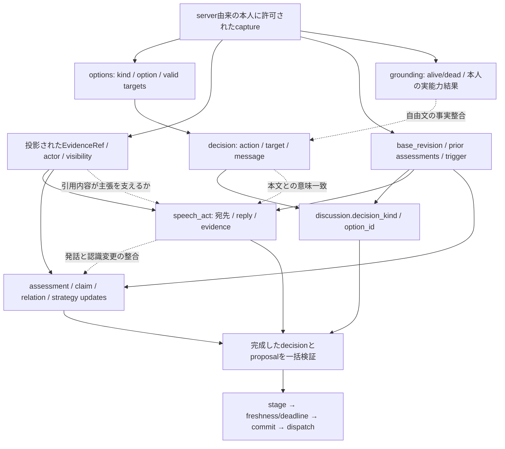

# Phase 6 構造化出力の依存と次の最小設計

T441。2026-09-20。製品変更0、新規LLM生成0。

## 現在地：既知／未知／今回の仮説

最新mainは `5a5635f`。専用branchの `b8b9b63` はmainを祖先に持ち、より新しいT436〜T439のkind-first結果を含む。指定されたモデル比較/C1/C2/提案/D077の本文は最新mainと同一だった。T427/T433/T435/T439 SAFE_RESULTSとT438判定の保存hashが前回記録と一致し、旧結果は再採点せず再利用する。`b8b9b63` のCI35418934411は全9job PASS。

**既知:** 5モデル全160件NONEでも本文回答は存在した。C1/C2は不採用。さらにkind-firstも既に32件実行済みで、NONE32→2、不一致23→18、HARD fail14→23、捏造0→8となり不採用。今回これらを再実行しない。oneOf微調整は終了する。

**未知:** 意図と本文・更新の同時生成負荷の寄与、intent先行の意味品質、単一shapeの生成容易性とnull誤用、2callの改善量/遅延。kind-firstは順序依存を支持するが、巨大outputが唯一原因という証明ではない。context不足・モデル交換を主因へ戻さない。

**今回の仮説:** intentを先に確定する表現と、本文・更新の依存を明示する1call契約で意味整合を改善できるか。今回はその検証可能な最小契約を設計する。新候補の意味改善を測定済みとはしない。

## 現契約の依存関係

実線はcode上の構造的な拘束、点線は必要だが包括的には保証されない意味関係。

生成順と依存順は別である。現wireはdecision→discussion。chatではmessageがdecision内2番目、speech_actはdiscussion内11番目。詳細の7枝表・固定runtime調査は [生成順の静的分析](PHASE6_STRUCTURED_OUTPUT_STATIC_20260919.md) を再利用する。

| 枝 | 直下必須field数 | 現wireのkind位置 | 主要な依存 |
|---|---:|---:|---|
| NONE | 1 | 1 | 対話行為を付けないことの意味妥当性 |
| CLAIM | 5 | 2 | 存在するsubject、topic/stance、根拠参照 |
| QUESTION | 5 | 2 | addressee、nullable subject/source、topic |
| ANSWER / REBUTTAL | 各7 | 各4 | 他者のreply元とactor、QUESTION/CLAIM解釈、根拠 |
| OPINION_CHANGE | 6 | 4 | 本人の過去評価prior、異なるcurrent、新しいcauses |
| RELATION_HYPOTHESIS | 6 | 3 | 関係両端、relation、confidence、根拠 |

これはtoken数や思考量ではない。nested refの項目と文字長も費用を持つ。kind-firstでは位置だけ1へ変え、義務は減らしていなかった。

## 現validatorの保証と限界

code根拠: `ai_client/llm/decision.py` の `parse_llm_output` / `_validate_semantic_output`、`ai_client/discussion/model.py` の各型、`ai_client/discussion/projection.py::_grounding_sources`、`ai_client/brain/controller.py` の受理・反復・dispatch経路。

| 対象 | 現codeの保証 | 保証と混同しないもの |
|---|---|---|
| shape/action | JSON/schema、closed keys、選択可能optionとaction、対象数/重複、role候補、文字/byte上限 | 自然文が適切な戦略か |
| ref/visibility | proposalの全refが投影とcapture双方に完全一致。ClaimUpdate.claimはPUBLIC制約 | 実在refの本文が当該主張を支持するか |
| player/生死 | player fieldの存在、投票/能力targetはoffered valid_targets。inputのalive/death整合 | 全subjectをaliveに限定しない。死者の結果報告は合法。自由文の死亡断定は包括検査なし |
| ANSWER/REBUTTAL | reply元のrecord種・他者actor1名・宛先一致、型上のsource_interpretation | reply元が意味上本当に質問/主張か、本文が回答/反論か |
| OPINION_CHANGE | priorがcapture評価と一致、priorとcurrentが異なる、空でないcausesに新refあり | 新根拠から変更が合理的か |
| claim/update | claimのactor対応、評価対象の存在/自己評価禁止、型・件数/範囲 | claimの真偽、relationの正しさ、戦略の妥当性 |
| trigger/補助判断 | reaction source/channel、CO judgmentとdecision一致、vote ranking/preferred対象とdecision一致 | CO時機・投票先の推論 |
| ability/private state | 本人が既に受領したresult_id/target/revealed_role等を投影、snapshot整合 | 自由文で結果を正しく述べたか、許可済みprivate情報を無利益に自白したか |
| text | 上限付近の未完結末尾をTEXT_BOUND、直前自己exact/長文peer exactを検出 | 全文意味、全near-copy、秘密開示の否定/騙り/仮定を含む判定 |
| transaction | decision/proposal identity・revision一致、stage後freshness/deadline、commitからdispatch開始までawaitなし | providerが一回だから意味が整合するという保証 |

kind-firstの捏造8件は参照の存在だけでは防げなかった。`source_interpretation=QUESTION`をschemaのconstにしても、相手の自然文の意味がQUESTIONだったことを証明しない。単一shapeへ変えてもこの限界は残る。コードによる構造保証と、将来必要な意味保証の設計・独立評価を分ける。

## 一回で生成する必要があるか

現在の実装は完成したdecision/proposalを一回の応答としてparseするが、**一回の生成はauthority上の必須条件ではない**。必要なのは同じ許可済みsnapshotに束縛し、全体の検査が終わるまで部分適用せず、古くなった結果を捨てることである。

1call内のintent→messageでもautoregressiveに後続は先行値を条件にできる。ただしモデルが従う保証ではない。2callなら中間planを検査できる反面、call間のphase変更、deadline、cancel、二重適用を管理する新しい契約が必要になる。今回の最小案は1callのまま生成契約を分離し、既存のatomic受理を維持する。

「optional updates」はまず**更新なしを明示的な空配列/nullで表せる**意味で扱う。現契約ではkey自体はrequiredであり、欠落を勝手に補完する方式や更新種類の削除を同じ実験へ混ぜない。optional key化は別の変更要因になる。

## 今回のA/B/C対応と費用

最新ユーザーのA/B/Cは、前回A〜E比較のB/C/Dに対応する。旧文書の識別子は改名しない。

| 今回案 | 最小の境界変更 | provider call/判断 | latencyの見込みと不確実性 |
|---|---|---:|---|
| A Intent-first | intent / realization / updatesの閉envelopeと厳密な旧形adapter | 1 | 追加round tripなし。出力長/grammar/選択の変化は未測定。旧qw9 p50約5.61秒を達成予測には使わない |
| B 単一shape | 17 distinct fieldの共通形、kind別null/型/根拠をstrict validatorで拒否 | 1 | 枝選択を減らせるがNONEも多数のnullを出すため、長さや遅延が増え得る。512tokenを勝手に増やさない |
| C Plan→Message | plan検査、二回目入力、中間stale/cancel、終端1回の保証 | 最大2 | 9判断で9→最大18call。1判断はL_plan＋L_message＋追加queue待ち。両callが現行と同費用ならservice時間は約2倍だが、実測前の仮定 |

Bのnullは無制約な逃げ道にしない。QUESTIONのsubject/sourceは元々null可、ANSWERのreply/宛先等は不可、とkind別に区別する。非該当fieldの非nullを黙って捨てずrejectする。空evidenceを現契約より一律禁止することも、逆に必須causesを空にすることも別契約変更である。

CはA/Bの有効性を先に確認してから検討。思考過程を生成させず、外形的intent/refsだけをplanとする。誰を疑い、COし、騙り、投票するかはLLMに残す。regexからactや根拠を補完しない。

## 成果物対応と次の最小案

1〜2の依存図/複雑度は本書と前回静的分析。3〜9のkind-first設計・実測・3軸/各違反差・不採用/打切りは [保存結果](PHASE6_KIND_FIRST_RESULT_20260919.md) と [32件safe結果](handoffs/tasks/T439_SAFE_RESULTS.json)。10〜13の比較は本書と [既承認の概念比較](design/PHASE6_STRUCTURED_OUTPUT_OPTIONS.md)。

14の最小案は **A Intent-firstのtest-only envelope＋strict adapter**。[新詳細設計](design/PHASE6_INTENT_FIRST_PROBE_DESIGN.md) のfield map/拒否境界/検証計画は、[T443独立審査](handoffs/tasks/T443_INTENT_FIRST_REVIEW.md)で **APPROVED**。製品schema、ゲーム規則、modelを変えず、単一shapeやoptional key化を同時に混ぜない。

承認対象SHA-256: `36ffebc9ff7ca0afb99a5c0a857938e4f496fff33fcea1a7ae7f4a98c4004fd2`。審査記録SHA-256: `4c442aa570f9911b322b3e1d4849fd590d46ad477d65f09e65e2685101b51a46`。設計本文のDRAFTは提出時snapshotとして保持し、この外部判定を承認正本とする。承認範囲はtest-only実装へ進む詳細設計であり、provider実行・製品採用・品質改善の承認ではない。

今回は設計と静的補完のみ。新候補のfocused implementation、人工生成、意味評価は未実施であり、成功とは扱わない。次回provider前には既知のouter所有監視誤検知も修正する。T440 token accountingは別scope、通常game/Master Run/Phase7は未開始。
