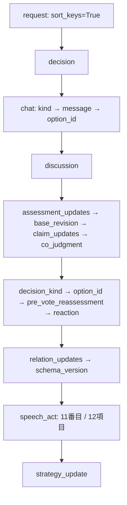

# 構造化出力の生成順と枝の負荷

T436。基点main `5a5635f`。製品未変更、旧生成の意味再採点なし。

## 既知・未知・仮説

既知: T427の160出力は全NONE、本文回答にはモデル差。C1/C2は不一致23→26、HARD fail14→17で不採用。実context不足は今回の主因にしない。
未知: 枝内kind位置の寄与、自然文と接地済み意味表現・state更新の同時生成負荷の寄与。複数モデルの共通失敗だけで能力要因を完全除外しない。
今回の仮説: kindを各枝の先頭へ置く単独対照が、HARDを悪化させず本文とactの結合を改善するか。

## 生成順

`ai_client/llm/backend.py` と人工suiteの `wire_bytes` は再帰的sort_keysを使う。Python上の著者順・required配列順・wire properties順を区別する。

chat本文はdecisionの2番目、discussionより前。vote/none/COのdecisionは別shapeで、常にmessageが存在するわけではない。著者のproposal requiredはspeech_actが5番目だが、required配列は存在義務の指定であり生成順の指定ではない。C1はproposal propertiesのみを変え、出力32/32で5番目になっても品質は改善しなかった。

## speech_actの枝別負荷

全枝はclosed、全property必須。以下の数は直下field数であり、nested EvidenceRefのfield数、token数、実行時間ではない。nullable/空配列可と必須keyは別概念。

| 枝 | wire上のproperties順 | kind位置 | kind前 / 後 | kind以外の義務 |
|---|---|---:|---:|---|
| NONE | kind | 1/1 | 0/0 | なし |
| CLAIM | evidence, kind, stance, subject_player_id, topic | 2/5 | 1/3 | 本人に見えるevidence、対象、topic/stance |
| QUESTION | addressee_player_id, kind, source, subject_player_id, topic | 2/5 | 1/3 | 宛先、nullable source/subject、topic |
| ANSWER | addressee_player_id, evidence, in_reply_to, kind, source_interpretation, stance, topic | 4/7 | 3/3 | 宛先、実参照、QUESTION解釈、stance/topic/evidence |
| REBUTTAL | addressee_player_id, evidence, in_reply_to, kind, source_interpretation, stance, topic | 4/7 | 3/3 | 宛先、実参照、CLAIM解釈、stance/topic/evidence |
| OPINION_CHANGE | causes, current, dimension, kind, prior, subject_player_id | 4/6 | 3/2 | 空でない原因、前後値、dimension、対象 |
| RELATION_HYPOTHESIS | confidence, evidence, kind, relation, source_player_id, target_player_id | 3/6 | 2/3 | 確信度、evidence、関係、両端player |

重要な区別: kind値を生成するまで全枝が残るわけではない。最初のkeyがkindなら現順ではNONE、evidenceならCLAIM、causesならOPINION_CHANGEへ既に絞られる。addressee_player_idのprefixにはQUESTION/ANSWER/REBUTTALが残る。kind-firstでは最初のkeyを全枝kindに揃え、値で分岐させる。義務数は減らさない。

## 固定runtimeの一次資料確認

2026-09-19にstock `093adb242` とPrism `d8f26eec76da6d09bb708bcba51ef64b8cd868a3` の公式sourceを取得。モデルdownload/追加生成なし。

- [stock converter](https://github.com/ggml-org/llama.cpp/blob/093adb242/common/json-schema-to-grammar.cpp) と [Prism converter](https://github.com/PrismML-Eng/llama.cpp/blob/d8f26eec76da6d09bb708bcba51ef64b8cd868a3/common/json-schema-to-grammar.cpp) は同一bytes。SHA256 `4d58b73438e97ac4e2d11dbb0309702d6899088d3c44a75a2dcb9c57697bb288`。
- `_build_object_rule` はproperties走査順からrequired列を作り、その順に連結。required配列自体の順序は使わない。`oneOf`は各枝grammarの選択肢へ変換される。先頭枝を自動採用する規則ではない。
- [JSON型](https://github.com/ggml-org/llama.cpp/blob/093adb242/common/json.h) は挿入順を保持。stock/Prism同一SHA `1b8a34c15ec62f2f13ae5809b723962b4d075a1a28af6902d9b64de6e607ee72`。
- [server parser](https://github.com/ggml-org/llama.cpp/blob/093adb242/tools/server/server-common.cpp) がresponse_format.json_schema.schemaを取り出す。[chat経路](https://github.com/ggml-org/llama.cpp/blob/093adb242/common/chat.cpp) のQwen3.5対応はresponse formatをgrammarへ渡し、[PEG builder](https://github.com/ggml-org/llama.cpp/blob/093adb242/common/peg-parser.cpp) のSCHEMA経路はconverterへ渡す。PEGのstock/Prism SHAも同一 `0ddb6d02ff98120f14eff51a4f3bc6df574c0adbfe290597f57beaccdf8c361e`。
- grammarは許されるtokenを制限する。分岐の相対確率・意味上正しい枝は保証しない。oneOfの一般的排他性検証も製品validatorの代替ではない。このspeech_actはkind constが相互排他的。

stock/Prismでchat/server/source全体は同一ではないが、今回のproperties順/union変換に差は見つからない。kernel/量子化/model能力の差は残る。binaryをsourceから再buildした同一性証明ではない。別build option（llguidance経路等）や将来版まで一般化しない。

## 保存rawとの照合

T427の5profile×32件をread-onlyでkey順だけ抽出。全160件で保存結果のfinal hashと一致。rootはdecision→discussion、discussionは上表のalphabetical順、speech_actはkindだけ。非NONEは0なので、旧rawから非NONE枝内順を実測確認したとは言わない。

C1出力順32/32の観測はT432/T435承認結果を再利用。旧本文の再表示・意味再採点・再生成は0。構造一致とconverter sourceを合わせると順序強制の機構は支持されるが、NONE固着の単独原因かは未確定。

ローカル測定: `logs/t436-kind-first/static-schema.json`、`saved-raw-order.json`、`runtime-source/`。前者は現在の32caseの先頭schemaを機械抽出、後者は旧rawのmetadata抽出。private原文はこの文書に含めない。

次は独立承認した [kind-first設計](design/PHASE6_KIND_FIRST_PROBE_DESIGN.md) に従う限定対照。失敗時に枝順等を追加微調整せず [A〜E比較](design/PHASE6_STRUCTURED_OUTPUT_OPTIONS.md) へ設計論点を移す。
