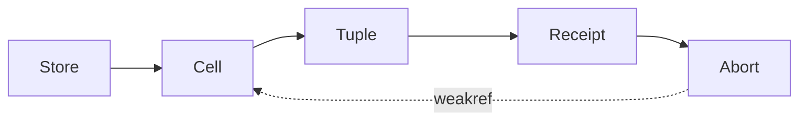

# T533: finalize bundle ownership限定改訂

Status: APPROVED

## 適用範囲

`PHASE6_V2_RESERVED_FINALIZE_DESIGN.md` の3.4節/3.5節のpredecessor強参照禁止とexact tuple CASを同時に満たすための限定改訂。
旧本文の`FinalizeConflictObservationV2.exact_expected_tuple`/`exact_observed_tuple_or_null`のpersistent強参照とreceiptのexact bundle強参照を本改訂で置換する。他のstate/terminal/notification/catalog/authority条件は不変。
実測・provider・claim/activateは追加しない。T530元承認の他scopeは再審査しない。

## 不整合と単一所有者

builtin tupleはweakref不能である。element identityだけの検査や`id(tuple)`整数のみでは、same-value replacementとID再利用を確実に拒否できない。
private immutable `LeaseBundleCellV2`を導入する。closed fieldsは`stage`, `bundle_identity`, `exact_tuple`, `__weakref__`。
`stage`は下表の4値。cellは既存private issuerのみ発行し、copy/pickle/public constructorは禁止。
cellとidentityは一対一で発行し、発行済みidentity再利用を拒否する。registryはexact storeが所有するWeakKeyDictionary(identity→weakref(cell))とし、owner loop上だけで登録/照合する。identityはweakrefableなprivate発行objectであり、整数idは用いない。historyを無制限に保持しない。

storeはactive cellを単一slotで強所有する。既存のprivate tuple read APIはcurrent cell.exact_tupleを返すread-only viewとし、独立した書込み可能なtuple slotを残さない。
初期PREPARING publish、RESERVED CAS、rev1/rev2 INVALIDATED CASともcell単位で行う。CAS内にawaitを入れず、全allocation/検査を先に済ませ、単一代入でpublishする。

receipt/abort/conflictはpredecessor cell/raw tupleを強参照しない。`expected_bundle_identity`, `expected_cell_weakref`, `expected_stage`/closed shapeを保持する。
INVALIDATED等の後継候補cellはpublish前にprebuildするが、そのpredecessorへのbacklinkもweakrefである。
通知observation、pending、terminal exact aliasは既存設計どおり。一般的な既存session/controller/store ownership graphは今回禁止の対象外。
禁止するcycleは`predecessor cell/tuple → receipt → abort/conflict → 同じpredecessor cell/tuple`である。

## CAS contract

CAS直前にstore active cellを一回readしてephemeral local aliasへ保持する。receiptのweakref dereferenceがそのexact cellであること、stage、issued identity、exact tuple要素、receipt/lease/capture関係をすべて検査する。
store CASは`active_cell is expected_cell`を要求する。callerから来た同値cell、同じ要素のnew tuple、新cell、reused identity、foreign issuer、dead weakrefは拒否しCONFLICT_HOLDへ移る。
照合用local aliasはcall終了後にowner graphへ保存しない。old cellは外部local参照がなくなれば解放可能とする。

conflict observed側はvalid private cellのweakref、identity、closed shapeだけを保持する。異物はclosed shape/error enumだけを記録し、任意object/tupleのstrong参照を保存しない。
CAS expectedであるcurrent stage receiptのweakrefだけはliveかつstore active cellと同一必須。正常successor publish後、predecessor receiptの旧cell weakrefは消滅してよく、identity/lineage照合にだけ使う。current expected weakref消滅時に再構成・探索・retry・推定CASを行わない。公開証拠は従来の固定enumだけである。

## Closed stage matrixとfield migration

| cell stage | identity type | tuple arity | lease status/revision | receipt type |
|---|---|---|---|---|
| PREPARING | PreparingBundleIdentityV2 | 2: lease,receipt | PREPARING/0 | PreparingLeaseOwnerReceiptV2 |
| RESERVED | ReservedBundleIdentityV2 | 3: lease,capture,receipt | RESERVED/1 | ReservedCaptureOwnerReceiptV2 |
| PRECAPTURE_INVALIDATED | PreCaptureInvalidatedBundleIdentityV2 | 2: lease,receipt | INVALIDATED/1 | PreCaptureInvalidatedOwnerReceiptV2 |
| RESERVED_INVALIDATED | ReservedInvalidatedBundleIdentityV2 | 3: lease,capture,receipt | INVALIDATED/2 | ReservedInvalidatedOwnerReceiptV2 |

各identityは同名のprivate weakrefable marker型で新規発行する。INVALIDATED identityはpredecessor identityを再利用しない。
全receiptは`cell_identity`（exact cell.bundle_identity）と`cell_weakref`を持つ。receipt→cellはweakのみ。cell.exact_tuple末尾はexact receipt、receipt.cell_weakref()はcurrent段階のみexact cell必須。predecessor_identityは別lineage fieldである。
abort bundleは後継INVALIDATED candidate cellを強所有してよい。`exact_store_tuple`は削除し`candidate_cell`へ移す。candidate_cell.exact_tupleのlease/receipt/captureは承認済み候補のexact aliasesであり、candidate cellからpredecessor cellへのstrong backlinkを作らない。

| 旧persistent field | 置換 |
|---|---|
| PreparingLeaseOwnerReceiptV2.exact_bundle / ReservedCaptureOwnerReceiptV2.exact_bundle | cell_identity + cell_weakref |
| FinalizeConflictObservationV2.exact_expected_tuple | expected_bundle_identity + expected_cell_weakref + expected_stage |
| FinalizeConflictObservationV2.exact_observed_tuple_or_null | observed_bundle_identity_or_null + observed_cell_weakref_or_null + observed_shape_or_null |
| FinalizePostcheckObservationV2.exact_expected_store_tuple | expected_bundle_identity + expected_cell_weakref + expected_stage |
| FinalizePostcheckObservationV2.observed_store_tuple_or_null | observed_bundle_identity_or_null + observed_cell_weakref_or_null + observed_shape_or_null |
| abort bundle.exact_store_tuple | candidate_cell（後継候補だけ） |

postcheckのその他owner/snapshot/lease/capture/terminal照合項目はそのまま保持する。postcheckのexpected/observed集合へcellやraw tupleを再び埋め込んではならない。foreign observedはshape/error enumのみ。正常な旧cell消滅を新current cellの不整合と混同しない。

## 追加acceptance

- PREPARING/RESERVED双方でexact cellによる正しい遷移。
- same elements/new tuple、新cell、foreign issuer、identity再利用の拒否。
- published slotが旧または新cellのどちらかでありmixed状態を読まない。
- swap後、call-local参照を解放するとold cellのweakrefが消える（GC検証）。
- abort/receipt/conflictからpredecessor cell/tupleへの直接strong cycleがない。
- conflict weakref消滅時のfail-closedと再試行不可。
- 既存v1経路不変、既存read API整合、provider等副作用0。

## 実装gate

本改訂の独立APPROVED後のみcell境界変更を実装する。T533のfocused/regressionと独立tool reviewへ新差分を含める。
